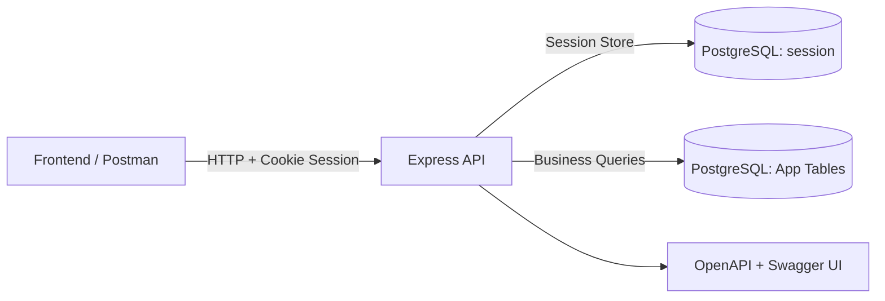
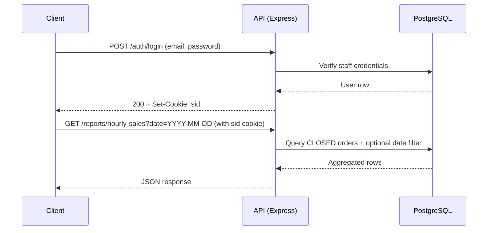

# Restaurant API

Backend API for restaurant operations using Node.js, Express, PostgreSQL, stateful session auth, and Zod validation.

## Features

- Auth: register, login, logout, current session user (`/auth/me`)
- Stateful auth sessions stored in PostgreSQL (`express-session` + `connect-pg-simple`)
- Role-based access control (`MANAGER`, `WAITER`, `BARTENDER`)
- API date/datetime response format normalized to `DD-MM-YYYY HH:mm:ss`
- CRUD modules:
  - Staff
  - Menu
  - Orders and order items
  - Restaurant tables
  - Sales reports
- Request validation with Zod
- Centralized error handling
- Pagination on list endpoints
- Postman collection and environment for quick testing

## Tech Stack

- Node.js (CommonJS)
- Express
- PostgreSQL (`pg`)
- Session middleware (`express-session`)
- PostgreSQL session store (`connect-pg-simple`)
- Password hashing (`bcrypt`)
- Validation (`zod`)
- Testing (`jest`, `supertest`)

## Architecture Diagram



## API Flow



## Requirements

- Node.js 18+ (recommended)
- PostgreSQL 14+ (recommended)
- PostgreSQL client tools (`psql`) (recommended for DB bootstrap)
- npm

## Setup

1. Install dependencies:

```bash
npm install
```

2. Create environment file from template:

```bash
copy config\\.env.example config\\.env
```

3. Update values in `config/.env`:

```env
JWT_SECRET=replace-with-your-jwt-secret
PASSWORD_RESET_MINUTES=15
SESSION_SECRET=replace-with-your-session-secret
SESSION_TTL_MINUTES=480
COOKIE_SECURE=false
COOKIE_SAME_SITE=lax
CORS_ORIGIN=http://localhost:5173

DB_USER=postgres
DB_HOST=localhost
DB_NAME=restaurant_db
DB_PASSWORD=replace-with-your-db-password
DB_PORT=5432

PORT=3000
```

4. Create database and import the provided schema dump:

```bash
createdb -U postgres restaurant_db
psql -U postgres -d restaurant_db -f restaurant_db.sql
```

Notes:

- `restaurant_db.sql` is a PostgreSQL plain dump of the schema (tables, constraints, indexes, sequences).
- Run with `psql` (recommended), because the dump contains PostgreSQL meta commands (`\\restrict` / `\\unrestrict`).
- If `DB_NAME` in `.env` is different, use that database name in the commands above.

5. Optional: seed minimal initial data (staff/menu/tables):

```bash
npm run db:reset-initial
```

## Run

```bash
npm start
```

Default server URL: `http://localhost:3000`

## Test

```bash
npm test
```

## API Modules

- `/auth`
  - `POST /auth/register`
  - `POST /auth/login`
  - `POST /auth/logout` (requires session)
  - `GET /auth/me` (requires session)
- `/staff`
- `/menu`
- `/orders`
- `/tables`
- `/reports`
  - `GET /reports/hourly-sales?date=YYYY-MM-DD` (optional date filter, `MANAGER` only)

## Auth Session Behavior

- Authentication is stateful: server stores session data in PostgreSQL table `session`.
- Browser/client stores only the session cookie (`sid`), not user/session payload.
- Session idle timeout uses `SESSION_TTL_MINUTES`.
- With `rolling: true` enabled, each valid request extends expiry.
- Example: `SESSION_TTL_MINUTES=120` means logout after 120 minutes of inactivity.
- For frontend on a different origin, send cookies on every request:
  - `fetch(..., { credentials: "include" })`
  - `axios` with `withCredentials: true`

## Reports Notes

- `GET /reports/hourly-sales`:
  - without `date`: returns all-time hourly aggregates
  - with `date=YYYY-MM-DD`: returns hourly aggregates only for that specific date
- Report aggregation only includes `CLOSED` orders.

## Response Date Format

- API JSON date/datetime values are formatted as `DD-MM-YYYY HH:mm:ss`.
- Example: `14-03-2026 09:15:00`.

OpenAPI files are available in `docs/` (e.g. `docs/openapi.json`).

## Documentation

- Scenario guide: `docs/one-day-operation-scenario.md`
- Release/setup runbook: `docs/release-runbook.md`
- OpenAPI: `docs/openapi.json` (plus split module files in `docs/`)
- Reports OpenAPI: `docs/openapi.reports.json`

When server is running:

- Swagger UI: `http://localhost:3000/api-docs`
- Raw OpenAPI JSON: `http://localhost:3000/openapi.json`

## Postman

Import:

- `postman/restaurant-api-models.postman_collection.json`
- `postman/restaurant-api-local.postman_environment.json`

## Scenario and Utility Scripts

### One-day operation scenario

Creates randomized operation data from `09:00` to `23:00`, including random staff/menu/tables/orders and report output.
The data source (data bank) is in `scripts/scenario.data-bank.js`.

```bash
npm run scenario:one-day
```

Run for specific date (`YYYY-MM-DD`, Windows cmd):

```bash
set OPS_DATE=2026-03-12&& npm run scenario:one-day
```

Important date rule:

- `OPS_DATE` is constrained to today through 7 days in the past.
- If omitted, scenario picks a random date in that window.
- If date is outside that range, script clamps to nearest allowed date.

Run with a fixed random seed (reproducible run):

```bash
set OPS_SEED=my-seed-value&& npm run scenario:one-day
```

### Cleanup scenario data

Cleanup orders and order items in the one-day operation window (`09:00-23:00`):

```bash
npm run scenario:cleanup-one-day
```

Full cleanup (also removes scenario-added staff/menu when not referenced):

```bash
npm run scenario:cleanup-one-day:full
```

Specific date (Windows cmd):

```bash
set OPS_DATE=2026-03-12&& npm run scenario:cleanup-one-day
set OPS_DATE=2026-03-12&& npm run scenario:cleanup-one-day:full
```

### Convert menu prices to IDR

Converts existing menu prices to Indonesian Rupiah scale.

```bash
npm run menu:price-idr
```

### Reset DB to minimal initial data (for new PC)

Clears transactional/test data, resets ID sequences, and seeds a small baseline dataset.

```bash
npm run db:reset-initial
```

Seeded login accounts (default password: `123456`):

- `admin@test.com` (`MANAGER`)
- `anna@test.com` (`BARTENDER`)
- `michael@test.com` (`WAITER`)

## Branch Change Summary (vs `origin/main`)

- Auth moved from stateless JWT flow to stateful session-based auth.
- Added session configuration (`express-session` + `connect-pg-simple`) and env keys.
- Added `/auth/logout` and `/auth/me`.
- Added global API date formatter to `DD-MM-YYYY HH:mm:ss`.
- Updated reports hourly endpoint to support optional `date` query filter.
- Expanded scenario scripts:
  - date window guard (today to 7 days past)
  - cleaner/randomized data bank
  - realistic generated emails (`name@domain`)
  - staff cap for random inserts (max 15 total)
  - category-based menu prefixes (`DRINK`, `FOOD`, `DESSERT`)
  - avoid duplicate base menu variants across runs
  - order generation uses available menu pool (existing + newly inserted)

## Notes

- Menu prices are now handled as IDR numeric values (e.g. `35000`).
- If you run scenario scripts multiple times, use cleanup commands per date to keep data tidy.
- Full cleanup removes scenario-marked random staff/menu data when no transaction references remain.
